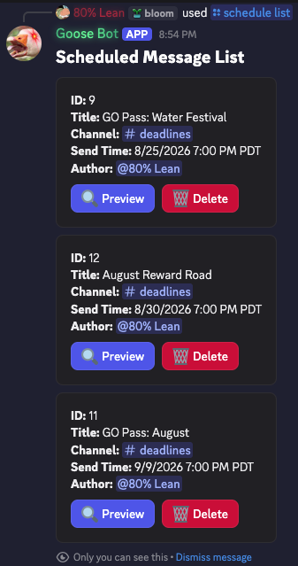
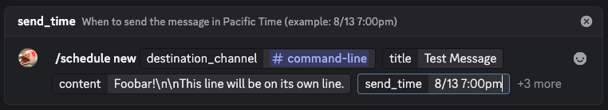
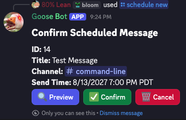
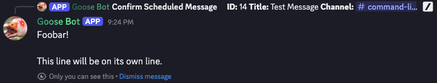
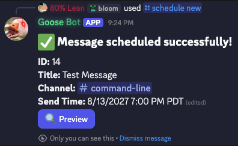

# Discord Bot Commands

Goose Bot offers a few different commands, mostly around scheduling, but some are just for fun. :)

# `/honk`

This is a test command that is basically there to do a quick check and see if the bot is responsive. If it is, it will respond back with random a Goose-related message. Some messages are rarer than others.

# `/hello`

This is actually a permission test command. Goose Bot will only say hi back to you if you're an admin or team member.

## Options

### `name`

Your name that Goose Bot will say back to you if it acknowledges you.

# `/schedule list`

**You must be an admin or team member to use this command.**

This will send you an ephemeral message that will list all of pending scheduled messages that haven't been sent yet.



You can preview the message contents using the "🔍 Preview" button. It will send as an as an ephemeral message, so you don't need to worry if it uses @mentions since it won't ping anyone.

Clicking on the "🗑️ Delete" button will delete the corresponding pending scheduled message.

# `/schedule new`

**You must be an admin or team member to use this command.**

This will send you an ephemeral message that will guide you through the scheduled message creation process.

This is what it looks like to write a basic scheduled message. Since the content is written in one line, you must specify line breaks with `<br>` or `\n`.



Once you send the `schedule new` command, the bot will send you an ephemeral message to confirm if this is what you want to send and when. **Make sure the send time is correct!**

At this point the message is considered a draft, so if you leave it as is it will never be sent. You can click "✅ Confirm" to put it into queue where the message will actually be sent when the send time comes, or you can click "🗑️ Cancel" to delete the draft.



You can also click the "🔍 Preview" button to see what the message looks like as an ephemeral message.



If you clicked "✅ Confirm", you'll then see a success confirmation message if everything went well on the backend.



## Options

### `destination_channel` \*Required

The channel name that your message should be sent to.

### `title` \*Required

The title of your scheduled message. This isn't actually seen by the regular users of the server. It's only for identification purposes in the list command.

### `content` \*Required

This is the actual content of the message! You can insert line breaks by using `<br>` or `\n`.

Note that Discord enforces a 2000 character limit. The bot will prevent you from writing anything longer than that.

### `send_time` \*Required

This is the date and time the message shoul be sent in Pacific Time. It must be formatted to something along the lines of:

```
8/13 7:00pm
```

### `image_attachment`

This is optional and allows you to upload an image to attach to the message.

### `image_url`

This is optional and allows you to attach an existing image to the message through a URL.

### `suppress_embeds`

This is optional and when set to true will suppress embeds from being generated.

# `/schedule update`

**You must be an admin or team member to use this command.**

This will update an already sent message that originated from the `schedule new` command. It will send a message in the channel you send the `schedule update` command in to confirm that you've made the update.

We recommend using this to update sent scheduled messages over the `force_edit` command.

## Options

### `discord_id` \*Required

A Discord message ID associated with a message sent by Goose Bot. This shouldn't be confused with the Goose Bot message ID which is only used to keep track of the scheduled message with the `schedule list` command.

### `content` \*Required

This is the actual content of the message! You can insert line breaks by using `<br>` or `\n`.

Note that Discord enforces a 2000 character limit. The bot will prevent you from writing anything longer than that.

### `image_attachment`

This is optional and allows you to upload an image to attach to the message.

### `image_url`

This is optional and allows you to attach an existing image to the message through a URL.

### `suppress_embeds`

This is optional and when set to true will suppress embeds from being generated.

### `remove_image`

This is optional and removes whatever image is attached to the message if it exists when set to true.

# `/force_edit`

**You must be an admin or team member to use this command.**

This will edit any existing message sent by Goose Bot.

If you are trying to edit a sent scheduled message, we recommend using the `schedule update` command instead.

## Options

### `channel_id` \*Required

The Discord channel ID where the message currently is.

### `discord_id` \*Required

A Discord message ID associated with a message sent by Goose Bot. This shouldn't be confused with the Goose Bot message ID which is only used to keep track of the scheduled message with the `schedule list` command.

### `content` \*Required

This is the actual content of the message! You can insert line breaks by using `<br>` or `\n`.

Note that Discord enforces a 2000 character limit. The bot will prevent you from writing anything longer than that.

### `image_attachment`

This is optional and allows you to upload an image to attach to the message.

### `image_url`

This is optional and allows you to attach an existing image to the message through a URL.

### `suppress_embeds`

This is optional and when set to true will suppress embeds from being generated.

### `remove_image`

This is optional and removes whatever image is attached to the message if it exists when set to true.

# `/puppet`

**You must be an admin or team member to use this command.**

This will control Goose Bot to say something anywhere instantly.

## Options

### `destination_channel` \*Required

The channel name that your message should be sent to.

### `content` \*Required

This is the actual content of the message! You can insert line breaks by using `<br>` or `\n`.

Note that Discord enforces a 2000 character limit. The bot will prevent you from writing anything longer than that.

### `image_attachment`

This is optional and allows you to upload an image to attach to the message.

### `image_url`

This is optional and allows you to attach an existing image to the message through a URL.

### `suppress_embeds`

This is optional and when set to true will suppress embeds from being generated.

# `/help`

This will post a link to this document. You're already here reading it, so you probably don't need to run this command.
